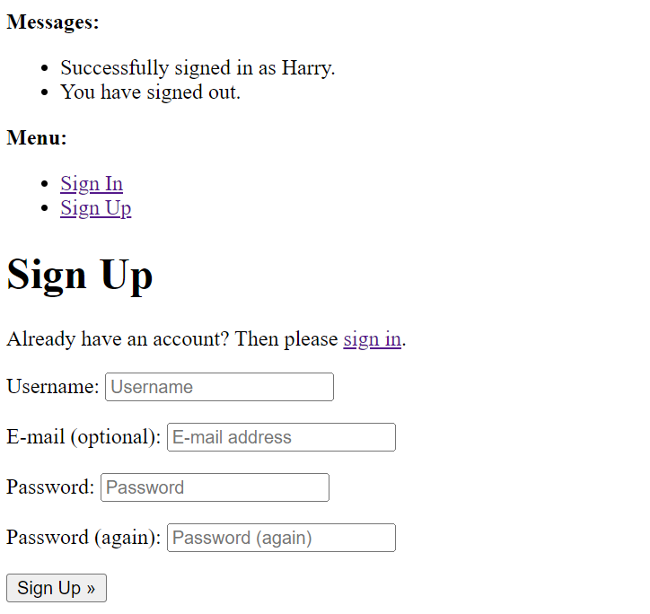

navbar- taken from codestar blog

# Football Signup 

Football Signup is a site designed for people to organise and register for football events. A superuser can create an event, and users can view this event, and the current participants. They can also see if any of the participants are bringing balls, bibs and any guests. This site was inspired by my own real life problems when trying to arrange football matches, and having to use WhatsApp groups and Doodle. My idea was to try to simplify this into a site, where users can get all of the information that they require in one place.

## Features

The sites features include the following:

### Index Page

- The index page, when not logged in, appears as below, with all events visible. The navbar contains links for Home, to Register, and to Login:

- The index page, when a user is logged in, is very similar, except the difference in the Navbar:

### Sign in / Create account pages

- The sign in page appears as below:

- If a user wants to create an account, they will see the following page:

### Event Detail Page

- If a user clicks on an event, the following page will load. Clearly visible on top are the event details, and below a table of particpants, as well as whether they are bringing balls or bibs.

- If a user clicks on the register button, assuming they are logged in, they will be taken to the following page:

### Event Registration Page

### Unregister Modal

- If a user has registered, and wishes to unregister, they can click the unregister button by their name on the table, which will bring up the following modal box:

## Testing  

### Code validation

#### CSS

- All of the CSS has passed the W3C validator, as the screenshots below will testify:

**Create Account**  

  

**Event Detail**  

  

**Event Registration**  

  

**Index Page**  

  
  

#### HTML

- The code validation for the HTML of the pages can be found below. Please note the comments regarding the errors.

**Index Page**  

  

**Event Registration**  

- This error means that a lang attribute has not been assigned. This is not an error that will cause problems with how the website works, so I have not addressed it.  

 

**Event Detail**  

- These errors are a result of a desgin choice that I have made. In the table in the Event Detail page,the name of each person who has signed up can be found in a table row, with cells for Unregister, Balls, and Bibs. If, when signing up for an event, a user ticks the guest box, then this creates a new table row with the user's name, followed by 's guest. As the guest does not have the option to then fill in this data, a row is created without the other columns having entries. I made this decision to avoid having a fifth column with a value of guess, and because it makes it easier to see who is bringing a guest. Although this returns an error, it doesn't have any visual impact.

 

**Create Account**  

- This is a repeat of the lang attribute not being assigned,as on the event detail page.  

 

**Login**  

- This is a repeat of the lang attribute not being assigned,as on the event detail page. 

 

### PEP8 validation  

**Signup**

- Below you will find screenshots of the python files from the signup section. In total, there are 3 errors. However, these are all minor and do not impede in any way the running of the app.

  

  

  

  

  

  

**footballSignup**  

- Below you will find the screenshots of the PEP8 validation for the python files from footballSignup. The only errors can be found in the password validators. As these are pre-generated by Django, they do not cause any issues with the running of the site.  

  

  

  

  

### Errors

During development, I encountered several errors. I will detail some of them below:

#### Sign up error message

- This error was displayed when trying to create an account, and filling in an email address. I had to specify the preferred authentication method for users of the site, and disable email verification. The solution to this was to add the following code to my settings.py file:  

  

#### 404 error message

  

- This error message was returned while I was trying to create the unregister function of my website. This presented me with a lot of difficulties. The URL was wired correctly, as can be noted from the message, as it says the current path matched the last one. The issue was that I not getting the pk of both the registration object *and* the event object. However, even when I had figured this out, I tried to create a form, similar to the registration form- however, as it was a blank form, this returned an error. In the end, I implemented a modal in the event detail page, which was able to carry out the intended functionality.

  

## Deployment

This project has been deployed to Heroku. I will detail the steps I took in order to deploy the project below:

1. First of all,I logged into Heroku, clicked on the button 'new' in the top right-hand corner, and then selected 'Create new app' from the drop down menu.

2. I was then prompted to choose a name for my project, which must be unique. In my case, the app name is football-signup. You must also choose a region- in my case I chose Europe.

3. Then, clicking on the resources tab, I entered Heroku Postgres in the add-ons search field. This is the database used for the project.

4. Next, by clicking on the 'settings' tab and then 'Reveal Config Vars', I obtained the Database URL. Moving now to Gitpod, I created a file called env.py to store all the environment variables.

5. In env.py, I then created an environment variable as can be seen below:  

    os.environ["DATABASE_URL"] = " "  

    I then put the value from the DATABASE_URL Config Var between the double quotes.

6. In env.py, I then created a new environment variable for the secret key, as can be seen below:  

    os.environ["SECRET_KEY"] =  " "  

    I then created my own secret key and put it between the double quotes.

7. I then returned to the settings section of Heroku, and created a new Config Var called SECRET_KEY, and assigned it the same value as in stage 6.

8. Next, I opened settings.py and added the following code:  

       
    
   This is to prevent the application from throwing an error if it is unable to find the file, since it won't exist in production

9. In settings.py, I then changed the insecure key to the path to the newly created secret key.

10. Again, in settings.py, I created a python dictioanry to connect the database to the application.  

11. Returning to Heroku, I now added a new Config Var called DIASBLE_COLLECTSTATIC, and set its value to 1. This was only to allow the project to be deployed, and would be subsequently deleted.

12. I then returned to settings.py in the application and added the following code:  

13. Another thing to be added was the directory for the templates:  

14. It was then necessary to add [TEMPLATES_DIR] to the DIRS section of TEMPLATES in settings.py:  

15. Before it could be deployed, the application had to be added to ALLOWED_HOSTS. This consisted of putting the app name, followed by .herokuapp.com. I also put 'localhost', in order to allow me to run the project locally.  

16. The next step was to create the Procfile, in the base directory of the app. The purpose of this was to  declare to Heroku that my application would accept http traffic, and to use Gunicorn, the production web server.

17. Following that, I added and committed the files to my GitHub repository.

18. Once this was done, I returned to Heroku, and clicked on the Deploy tab. I then selected GitHub as the deployment method.

19. When I had connected my GitHub account, I then used the search function and found the name of my repository. I then clicked on deploy branch to deploy my project.

## Technologies used

- The application is deployed on Heroku.
- The repository is hosted on GitHub.
- Gitpod was the workspace used to code, and build the content of the website, which would then be committed to GitHub.
- Git was used for version control.
- The static files are hosted using WhiteNoise.
- The Django framework is used.
- The Bootstrap CSS framework is used to easily and simply style the website, and make it easy to navigate for mobile phone and tablet users.
- The fonts representing the bibs and balls were taken from Font Awesome

## Credits

- When trying to build the function to delete a post, I used this [post](https://stackoverflow.com/questions/3805958/how-to-delete-a-record-in-django-models) from stack overflow as a guide.  

- As I was trying to implement the modal for the delete function, this [blogpost](https://simpleisbetterthancomplex.com/tutorial/2016/11/15/how-to-implement-a-crud-using-ajax-and-json.html) as a tool to help me understand the process better.  

- The [Django documentation](https://docs.djangoproject.com/en/4.0/) was an invaluable reference point during the project.  

- [Bootstrap documentation](https://getbootstrap.com/docs/4.1/getting-started/introduction/) was also very useful in order to find the right pre-designed html and CSS.  

- The use of Bootstrap cards was inspired by the Django blog walkthrough; a link to the repository can be found [here](https://github.com/Robn88/django-blog).